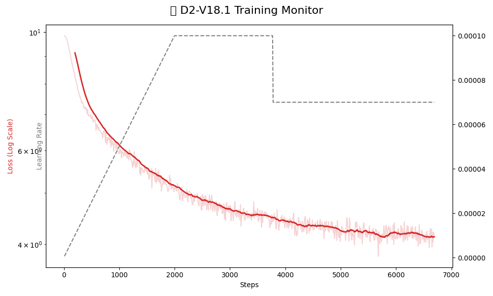

# 🚀 Resonance-Bottleneck-LLM (V18)

> *Not all attention is softmax. Some echoes.*

---

## 🧠 Overview | 概述

**Resonance-Bottleneck-LLM** is a novel Transformer architecture that introduces **latent-space compression** and a **resonance-based attention mechanism**.

**Resonance-Bottleneck-LLM** 是一種新型 Transformer 架構，結合 **潛空間壓縮（latent bottleneck）** 與 **共振式注意力（resonance-based attention）**，探索不同於傳統 softmax attention 的建模方式。

---

## ✨ Key Features | 核心特色

### 🔹 Latent Bottleneck Compression

Compresses representations into a lower-dimensional latent space before attention expansion.
在進入注意力計算前先進行潛空間壓縮，降低計算成本並提升表示效率。

---

### 🔹 Resonance-Based Attention

Introduces **phase interaction**, **amplitude gating**, and **interference dynamics**.
透過「相位（phase）」、「振幅（amplitude）」與「干涉（interference）」機制，建立全新的注意力模式。

---

### 🔹 Decaying Memory States

Maintains KV states with exponential decay for stable long-context modeling.
透過指數衰減（decay）的記憶機制，提升長序列建模的穩定性與效率。

---

### 🔹 Hybrid Architecture (Attention + Conv)

Alternates between attention blocks and causal convolution layers.
交替使用注意力層與因果卷積（CausalConv），同時捕捉全域語意與局部結構。

---

### 🔹 Softmax-Free Attention Path

Avoids traditional softmax normalization in favor of normalized KV accumulation.
不依賴傳統 softmax，而採用 KV 累積與正規化機制進行注意力計算。

---

## 🏗️ Architecture | 模型架構

* Latent Compression → QKV Expansion
* Phase-aware Resonance Gating
* KV Memory Accumulation with Decay
* Attention Output Normalization
* Hybrid Conv + Transformer Blocks

👉 詳細架構請參考上方圖示（Figure）。

---

## ⚙️ Training Setup | 訓練設定

* Model size: 768 dim / 24 layers
* Heads: 12
* Latent dim: 512
* Context length: up to 2048 (RoPE supported)
* Optimizer: AdamW
* Mixed precision (bfloat16)

---

## 📊 Design Motivation | 設計動機

Traditional Transformers rely heavily on softmax attention, which can suffer from:

* Inefficient long-context scaling
* Attention diffusion
* Lack of explicit memory dynamics

傳統 Transformer 的 softmax attention 在長序列下可能出現：

* 計算效率下降
* 注意力擴散（attention dilution）
* 缺乏明確記憶機制

This project explores an alternative:

> **Attention as resonance + memory evolution**

本模型嘗試將注意力重新詮釋為：

> **「共振 + 記憶演化」的動態系統**

---

## 🚧 Status | 開發狀態

* [x] Core architecture implemented
* [x] Training pipeline ready
* [ ] Large-scale training
* [ ] Benchmark evaluation

---

## 📌 Future Work | 未來方向

* Scaling to larger models (7B+)
* Integration with MoE
* Long-context (>32k) optimization
* Alignment & instruction tuning

---

## 📜 License

MIT License

---

## ⭐ If you like this project

Give it a ⭐ on GitHub — it helps a lot!

---
